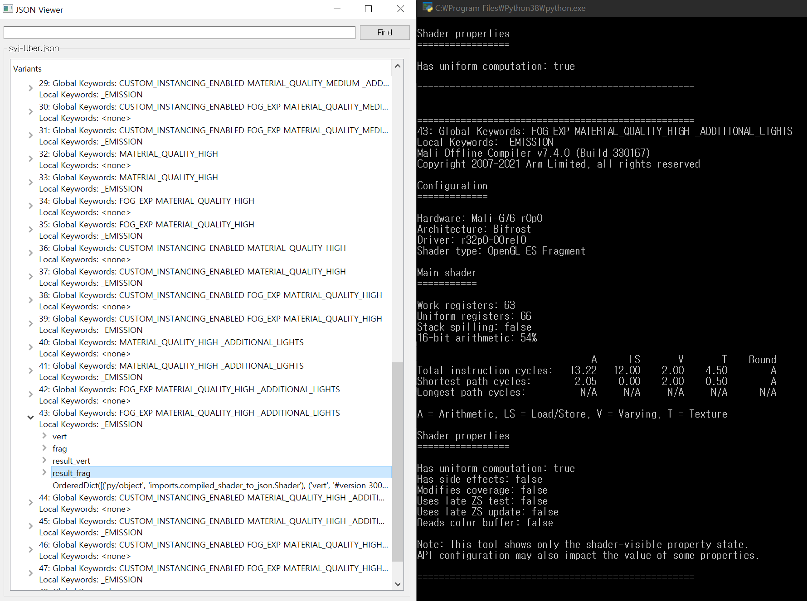

# Unity Shader Analyzer

**Analyzer variant shader** with ARM Mail offline compiler

# How to use

### Install

- Unity
- ARM Mail offline compiler
- Python 3.7 or later
    - `PyQt5` python package  (Type in command line `pip install PyQt5`)

### Prepare unity shader code

1. Open Unity
2. Select Shader, Show inspector Then Click “compile and show code”
   
    
    
3. Copy compiled code’s file path
   
    
    

### Analyze with program

1. Execute `1_analze_shader.py` file with python
Paste `1_analze_shader.py` into command line
   
    
   
    
   
2. Click **[vert, frag, result_vert, result_frag]** then you can **[Result]**
   
    